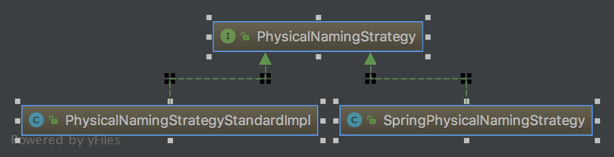

## {{ page.title }}

在用Spring Data JPA连接MySQL数据库时发生找不到表的问题，经分析发现数据库中的表明全部为大写，但Spring Data JPA在生成SQL时，会将所有的表名和列名转换为小写查询，再MySQL这种默认大小写敏感的数据库中就会出现问题。

分析了一下源码，发现Hibernate是用```PhysicalNamingStrategy```这个接口的某个实现来生成SQL中的相关名称的，默认有两个实现：



一个是Hibernate的，一个是Spring的，其中Spring的那个实现了xxxYyy自动映射为xxx_yyy这样的功能，但是会讲所有生成的名称转换为小写放到SQL里，而Hibernate那个就不会，换用```PhysicalNamingStrategyStandardImpl```就好了。


{{ page.date | date_to_string }}
